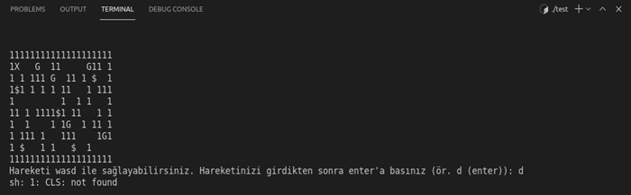
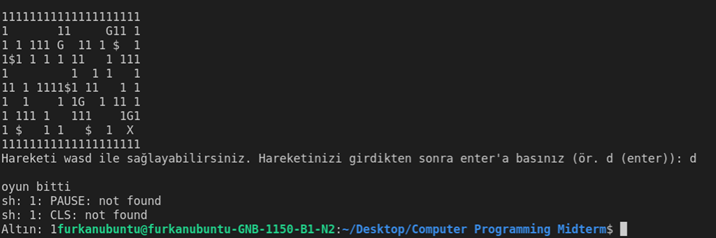

# `MazeGame`
In this project I developed a simple maze program that creates a maze with monsters and gold. In order to win the game you need to reach to exit. The game accepts  keyboard inputs w,a,s,d and it runs on command prompt.

## Screenshots

|  |
| :--:|
| *Testing Maze Bounds* |

|  |
| :--:|
| *Finishing Maze* |

